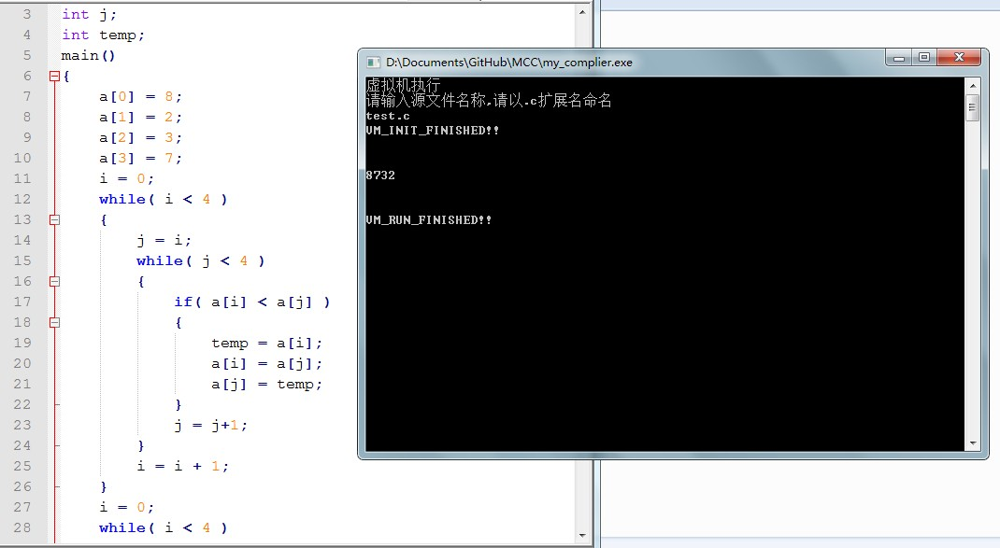

##简介

MiniC是一个Toy"编译器"，是我大二下学期，前后课余时间的拙作。

它并不完整，没有工业用途，只是为了更好的学习编译原理这门课。

本编译器目前实现了简单的赋值，条件，循环语句，基本输入输出。

支持int类型的变量和数组。

手写的简易词法分析后，采用递归下降(自上而下)分析法分析出语法和语义，生成四元式。

为了能让代码执行，又把四元式转换成类汇编指令的自行构造的简单指令集，最后调用一个简单的虚拟机进行解释。

数据结构设计较为简单，可扩展性和鲁棒性都较差，无奈，v0.3以后打算写一个更高效的编译器，并向TCC看齐，重构所有代码。

这个版本代码仅供初学者学习与交流。。

另外这个版本Bug较多，欢迎各位多多 fork && issue 

##特性

C语言语法词法子集，全静态内存分配，语法分析采用递归下降分析法，生成四元式并转换成自行构造的中间指令代码。

###数据类型

int类型的变量 or 数组

###语句

赋值语句

条件语句

循环语句

输入输出

###文法

参考源代码

###安装与使用

本程序使用DEV C++(GCC)编写，运行不需要其他任何函数库，只包含标准C库即可。

安装无需Makefile,只需运行DEV C++ IDE 编译即可。

 
###图片

##作者

chenai <wsy92@qq.com>

##License

Copyright (C) 2013-2015 chenai, MIT License
